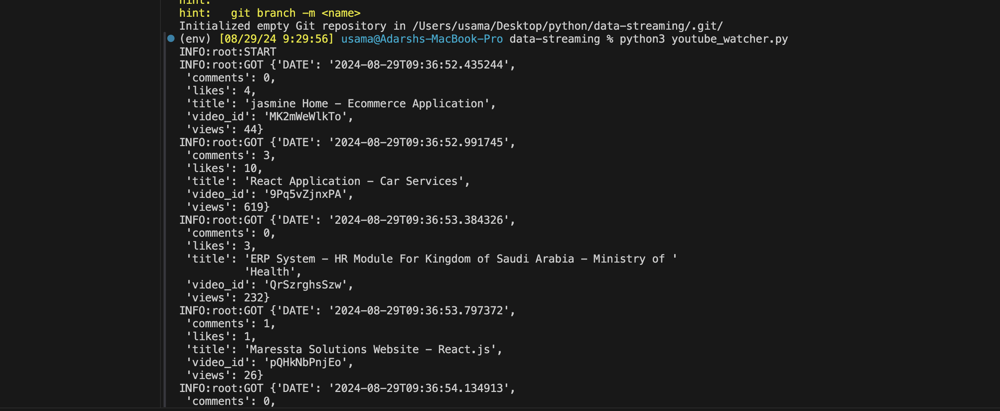
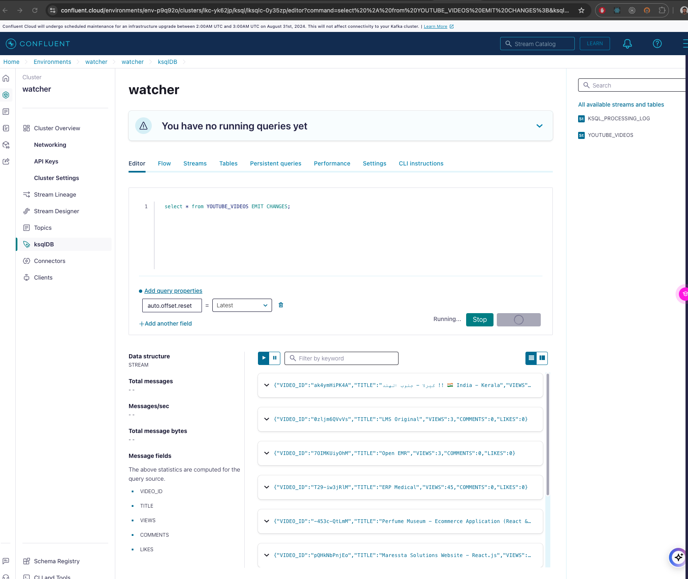

# YouTube Data Streaming Application

This project is a data streaming application written in Python that fetches video data from a YouTube playlist using the YouTube Data API and streams it to an Apache Kafka topic. The application uses Confluent Cloud for Kafka infrastructure and Schema Registry to ensure data integrity and schema compatibility.

## Table of Contents

- [Overview](#overview)
- [Features](#features)
- [Prerequisites](#prerequisites)
- [Setup](#setup)
- [Configuration](#configuration)
- [Running the Application](#running-the-application)
- [How It Works](#how-it-works)
- [Logging](#logging)
- [License](#license)

## Overview

The YouTube Data Streaming Application is designed to fetch video details from a specified YouTube playlist and send the information to a Kafka topic. It uses Avro serialization for efficient data serialization and schema validation using Confluent's Schema Registry. The application includes the current timestamp for each message sent to Kafka, allowing for precise tracking and analysis of video data.

## Features

- Fetches video data from a specified YouTube playlist.
- Streams video data to a Kafka topic.
- Uses Confluent Cloud for managed Kafka services and Schema Registry.
- Avro serialization ensures schema compatibility and efficient data storage.
- Includes timestamps for each message sent to Kafka for tracking purposes.

## Prerequisites

- Python 3.x
- Confluent Cloud account with access to Kafka and Schema Registry
- API Key for YouTube Data API v3
- Kafka and Schema Registry client libraries (`confluent-kafka`)
- Internet connection for accessing YouTube API and Confluent Cloud

## Setup

1. **Clone the Repository:**

   ```bash
   git clone https://github.com/yourusername/data-streaming-app-kafka-python.git
   cd data-streaming-app-kafka-python
2. **Create a Virtual Environment and Activate It:**
    - python3 -m venv env
    - source env/bin/activate
3. **Install Required Dependencies:**
   - pip install requests confluent-kafka avro-python3
4. Set Up Configuration:
     - Create a config.py file in the root directory and add your configuration settings:


## Running the Application
    source venv/bin/activate
    python3 youtube_watcher.py



